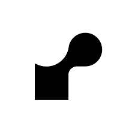
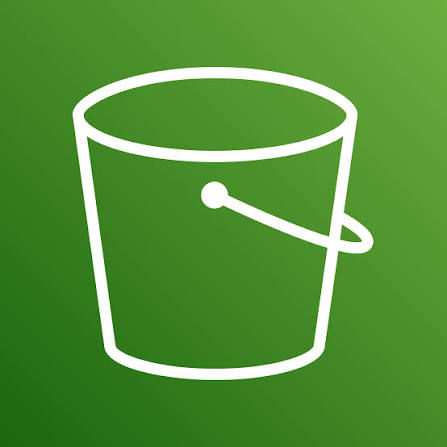
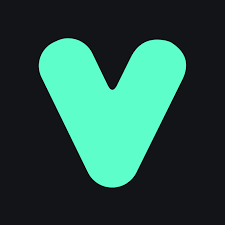
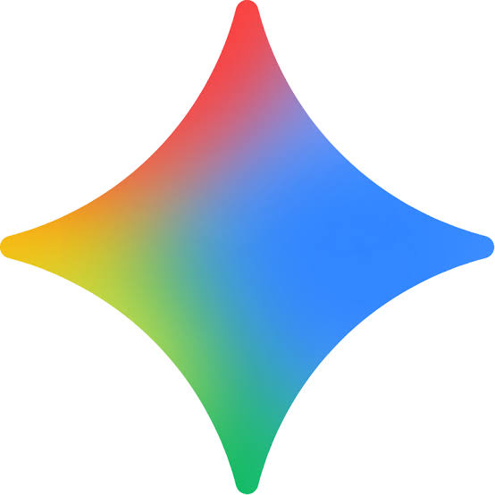
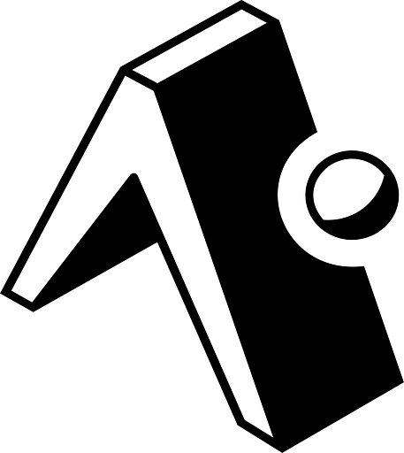

<h1 align="center">Hi, I'm Sayed Touati</h1>

  

  
  &nbsp;
  
  &nbsp;
  

---

## About Me

I'm a Full-Stack Developer who enjoys building clean, useful, and scalable web applications.

I work mainly with the MERN stack, and I'm interested in creating software that combines solid engineering, good user experience, and practical AI-powered features.

I'm always learning, improving my craft, and building projects that help me turn ideas into real products.

---

## Tech Stack

  

---

## Featured Projects

<table>
  <tr>
    <td width="50%" valign="top">
      <h3 align="center">MediBook</h3>
      

        
        
      

      

        A full-stack healthcare appointment platform designed to simplify scheduling, user management, and medical service workflows.
      

      

        
        
        
        
        
        
        
        
      

      <ul>
        <li>Multi-role authentication and authorization</li>
        <li>Appointment scheduling and management workflows</li>
        <li>RESTful APIs for users, doctors, and appointments</li>
        <li>Voice AI assistant for natural appointment scheduling</li>
      </ul>
    </td>
    <td width="50%" valign="top">
      <h3 align="center">HireReady</h3>
      

        
        
      

      

        An AI-powered interview preparation platform designed to help users practice, schedule, and improve their readiness for job interviews.
      

      

        
        
        
      

      <ul>
        <li>Generates interview practice sessions using AI</li>
        <li>Supports voice-based mock interviews with Vapi</li>
        <li>Uses Firebase for authentication and data storage</li>
        <li>Creates feedback after interview sessions</li>
      </ul>
    </td>
  </tr>
  <tr>
    <td width="50%" valign="top">
      <h3 align="center">E-Plant Shopping</h3>
      

        
        
      

      

        A React e-commerce interface built to explore product browsing, shopping flows, responsive UI, and frontend state management.
      

      

        
      

      <ul>
        <li>Responsive shopping interface</li>
        <li>Product listing and cart-style interactions</li>
        <li>Clean component structure</li>
        <li>Frontend state management practice</li>
      </ul>
    </td>
    <td width="50%" valign="top">
      <h3 align="center">Generation Iron</h3>
      

        
        
      

      

        A mobile workout tracking app designed to help users plan workouts, track exercises, and follow their fitness progress over time.
      

      

        
        
      

      <ul>
        <li>Tracks workouts, exercises, and training history</li>
        <li>Designed for gym-focused training with support for broader workouts</li>
        <li>Plans progress tracking and performance insights over time</li>
        <li>Future roadmap includes community features and AI-powered assistance</li>
      </ul>
    </td>
  </tr>
  <tr>
  <td colspan="2" valign="top">
    <h3 align="center">More Projects</h3>
    

      
      
    

    

      I’m continuously building and improving projects around full-stack development, AI applications, backend systems, embedded systems, and practical software products.
    

    

      
    

    <ul>
      <li>Exploring AI engineering, LLM-powered applications, and intelligent software workflows</li>
      <li>Building stronger backend systems with cleaner architecture and scalable foundations</li>
      <li>Developing interest in embedded systems, hardware-connected software, and low-level programming</li>
      <li>Continuously experimenting with tools, ideas, and products that solve real problems</li>
    </ul>
  </td>
</tr>
</table>

---

## Currently Exploring

  

- Building stronger foundations in **advanced backend architecture**
- Learning how to design **production-ready applications**, beyond just one stack
- Improving my understanding of **cloud deployment**, **CI/CD workflows**, and delivery pipelines
- Exploring **AI-powered features**, **LLMs**, and how intelligent systems can improve real products
- Practicing **clean, scalable, and maintainable software engineering**
- Developing long-term interest in **embedded systems** and software that connects with the physical world
